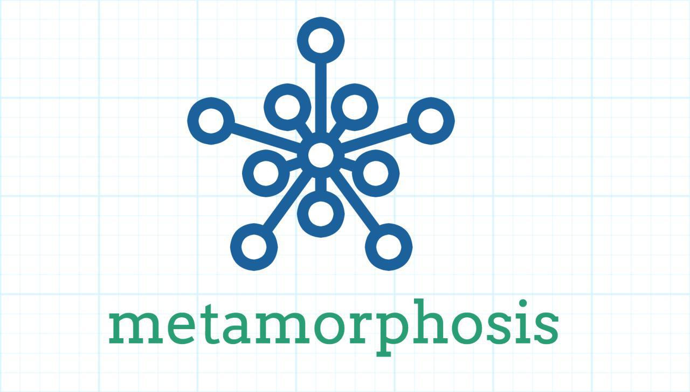

# Metamorphosis

> Easy and flexible Kafka Library for Laravel and PHP 7.



[](https://packagist.org/packages/leroy-merlin-br/metamorphosis)
[](LICENSE.md)
[](https://packagist.org/packages/leroy-merlin-br/metamorphosis)
[](https://travis-ci.org/leroy-merlin-br/metamorphosis)
[](https://coveralls.io/github/leroy-merlin-br/metamorphosis?branch=master)
[](https://styleci.io/repos/143462354)


- [Introduction](#introduction)
- [Requirements](#requirements)
- [Installation](#installation)
- [Quick Guide](#quick-guide)
- [Advanced Guide](docs/advanced.md)
- [Contributing](docs/CONTRIBUTING.md)
- [License](#license)


<a name="introduction"></a>
## Introduction

Metamorphosis provides a simple, straight-forward implementation for working with Kafka inside Laravel applications.

<a name="requirements"></a>
## Requirements

- PHP >= 7.1
- [Kafka Driver](https://github.com/edenhill/librdkafka)
- [Kafka PHP Extension](https://github.com/arnaud-lb/php-rdkafka)

<a name="installation"></a>
## Installation

**Important:** *Make sure that you already have installed the OS driver for kafka, and the kafka php extension.*


You can install library through Composer:

```
$ composer require leroy-merlin-br/metamorphosis
```

And publish the config file with:

```
$ php artisan vendor:publish --provider="Metamorphosis\MetamorphosisServiceProvider"
```

<a name="quick-guide"></a>
## Quick Guide

1. The Config: `config/kafka.php`

    The config file holds all information about brokers, topics, consumer groups and middlewares.

    To quickly start using, we can focus in two sections:
    - Brokers
    
        An array of brokers, with connection and authentication
       
        - Connections: required. can be an string with multiple connections separated by comma or an array of connections (as string)
        
        - Authentication: optional. out of the box, the package can connect with SSL Authentication only or without any authentication

        ```php
          'brokers' => [
              'price-brokers' => [
                  'connections' => 'localhost:8091,localhost:8092',
                  'auth' => [
                      'protocol' => 'ssl',
                      'ca' => storage_path('ca.pem'),
                      'certificate' => storage_path('kafka.cert'),
                      'key' => storage_path('kafka.key'),
                  ],
              ],
              'stock-brokers' => [
                  'connections' => ['localhost:8091', 'localhost:8092'],
                  'auth' => [], // can be an empty array or even don't have this key in the broker config
              ],
          ],
        ```

    - Topics
        
        An array of topics configuration, such as the topic name, which broker connection must use, consumer groups and middlewares
        
        Here we can specify the group consumers, each topic can have multiple groups, 
        and each group holds the configuration for which consumer, offset and middleware must use  

        ```php
          'topics' => [
              'price-update' => [
                  'topic' => 'products.price.update',
                  'broker' => 'price-brokers',
                  'consumer-groups' => [
                      'default' => [
                          'offset' => 'initial',
                          'consumer' => '\App\Kafka\Consumers\PriceUpdateConsumer',
                      ],
                  ],
              ],
          ],
        ```

2. The Consumer:
    
    After making all needed configs, you need to create the consumer, which will handle all records received
    from the topic specified in the config.
    
    Creating the consumer is easy as running the following command: 
    ```bash
    $ php artisan make:kafka-consumer PriceUpdateConsumer
    ```
    This will create a KafkaConsumer class inside the application, on the app/Kafka/Consumers/PriceUpdateConsumer.php directory
    
    There, you'll have an handler method, which will send all records from the topic to him,
    also, will be available methods for handle exceptions (failure and warning)
    
    ```php
    use App\Kafka\Consumers\PriceUpdateConsumer;
    use Metamorphosis\TopicHandler\Consumer\AbstractHandler;
    use Metamorphosis\Record;

    class PriceUpdateConsumer extends AbstractHandler
    {
        public $repository;
         
        /**
         * Create a new consumer topic handler instance.
         *
         * @return void
         */
        public function __construct(Repository $repository)
        {
            $this->repository = $repository;
        }

        /**
         * Handle payload.
         *
         * @param Record $record
         *
         * @return void
         */
        public function handle(Record $record): void
        {
            $product = $record->getPayload();
                    
            $this->repository->update($product['id'], $product['price']);
        }
    }
    ```


3. The Runner
    
    Now you just need to start consuming the price update topic.
    The simplest way to see it working is by running
    ```bash
    $ php artisan kafka:consume price-update
    ```
    
    This command will run in a while true, that means, it will never stop running.
    But, errors can happen, so we strongly advice you to run this command along with supervisor,
    like this example below:
    ```bash
       [program:kafka-consumer-price-update]
       process_name=%(program_name)s_%(process_num)02d
       command=php /var/www/default/artisan kafka:consume price-update --offset=earliest --timeout=-1
       autostart=true
       autorestart=true
       user=root
       numprocs=6
       redirect_stderr=true
       stdout_logfile=/var/log/default/kafka-consumer-price-update.log
    ```


<a name="license"></a>
## License

Metamorphosis is free software distributed under the terms of the [MIT license](http://opensource.org/licenses/MIT)

<a name="additional_information"></a>
## Additional information

Metamorphosis was proudly built by the [Leroy Merlin Brazil](https://github.com/leroy-merlin-br) team. [See all the contributors](https://github.com/leroy-merlin-br/metamorphosis/graphs/contributors).
