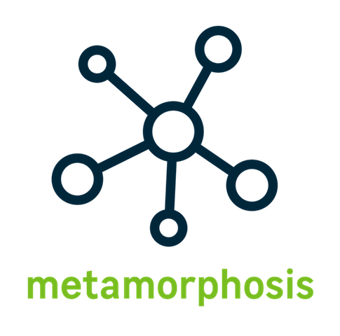

# Metamorphosis

> Uma biblioteca Kafka simples e flexível para Laravel e PHP 7.



[](https://packagist.org/packages/leroy-merlin-br/metamorphosis)
[](#licença)
[](https://packagist.org/packages/leroy-merlin-br/metamorphosis)
[](https://github.com/leroy-merlin-br/metamorphosis/actions?query=workflow%3ATests)
[](https://www.codacy.com/gh/leroy-merlin-br/metamorphosis/dashboard?utm_source=github.com&utm_medium=referral&utm_content=leroy-merlin-br/metamorphosis&utm_campaign=Badge_Coverage)

- [Introdução](#introdução)
- [Requisitos](#requisitos)
- [Instalação](#instalação)
- [Guia rápido](docs/quick-usage.pt.md)
- [Guia avançado](docs/advanced.pt.md)
- [Como contribuir](docs/CONTRIBUTING.pt.md)
- [Licença](#licença)


<a name="introduction"></a>
## Introdução

Metamorphosis fornece uma implementação simples e prática para trabalhar com Kafka, em aplicações Laravel.

Prefere ler em outro idioma?
- [English](readme.md)

<a name="requirements"></a>
## Requisitos

- PHP >= 7.1
- [Driver Kafka](https://github.com/edenhill/librdkafka)
- [Extensão do Kafka PHP](https://github.com/arnaud-lb/php-rdkafka)

<a name="installation"></a>
## Instalação

### 1. Instale o driver Kafka 

No Mac OSX, instale a librdkafka com homebrew:

```bash
brew install librdkafka
```

No Debian e Ubuntu, adicione o [repositório APT da Confluent](https://docs.confluent.io/current/installation/installing_cp/deb-ubuntu.html#get-the-software) e então instale a librdkafka:

 ```bash
apt install librdkafka-dev
 ```

No RedHat, CentOS e Fedora, adicione o [repositório YUM da Confluent](https://docs.confluent.io/current/installation/installing_cp/rhel-centos.html#get-the-software) e então instale a librdkafka:

```bash
yum install librdkafka-devel
```

No Windows, referencie o pacote NuGet [librdkafka.redist](https://www.nuget.org/packages/librdkafka.redist/) no seu projeto do Visual Studio.

### 2. Instale a extensão PHP Kafka

No Linux, Unix e OS X, você pode instalar extensões usando a *PHP Extension Community Library* ([PECL](https://www.php.net/manual/en/install.pecl.intro.php)):

```bash
pecl install rdkafka
```
Após a instalação, adicione a extensão ao arquivo .ini:

```
extension=rdkafka.so
```
> **Importante:** Quando existem múltiplas versões do PHP instaladas, a PECL instala os pacotes apenas para a última versão do PHP.
Para especificar uma versão do PHP durante a instalação dos pacotes, 
baixe o código-fonte e compile o pacote especificando a versão do PHP desejada.

Exemplo para o PHP 7.4:

```bash
pecl download rdkafka
tar -xvf rdkafka-X.x.x.tgz
cd rdkafka-X.x.x
phpize
./configure --with-php-config=/usr/bin/php-config7.4
make
sudo make install
``` 

Após compilar e instalar, adicione a extensão ao arquivo .ini:

```
extension=rdkafka.so
```
Saiba mais sobre como [compilar extensões PECL](https://www.php.net/manual/en/install.pecl.phpize.php). 

No Windows, baixe a [DLL rdkafka](https://pecl.php.net/package/rdkafka/),
coloque o arquivo no diretório de extensões do PHP e adicione a extensão ao seu php.ini:

```
extension=rdkafka.dll
```

Saiba mais sobre pacotes [PECL no Windows](https://www.php.net/manual/en/install.pecl.windows.php)

### 3. Instale o Metamorphosis

Instale a biblioteca via Composer:

```bash
composer require leroy-merlin-br/metamorphosis
```

Publique o arquivo de configuração:

```bash
php artisan vendor:publish --provider="Metamorphosis\MetamorphosisServiceProvider"
```

Para instruções de uso, dê uma olhada no nosso [guia rápido](docs/quick-usage.pt.md).

<a name="license"></a>
## Licença

Metamorphosis é um software livre distribuído pelos termos [MIT license](http://opensource.org/licenses/MIT)

<a name="additional_information"></a>
## Informações adicionais

Metamorphosis foi orgulhosamente desenvolvido pelo time [Leroy Merlin Brasil](https://github.com/leroy-merlin-br). [Veja todos os colaboradores](https://github.com/leroy-merlin-br/metamorphosis/graphs/contributors).
