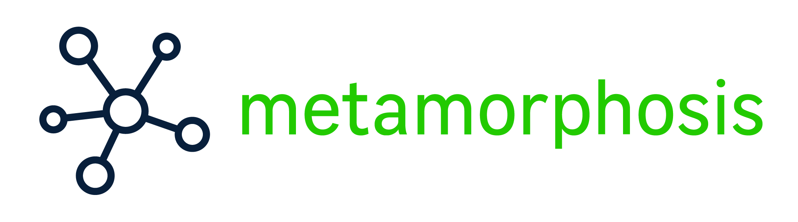

# Metamorphosis

> Uma biblioteca Kafka simples e flexível para Laravel e PHP 7.



[](https://packagist.org/packages/leroy-merlin-br/metamorphosis)
[](LICENSE.md)
[](https://packagist.org/packages/leroy-merlin-br/metamorphosis)
[](https://github.com/leroy-merlin-br/metamorphosis/actions?query=workflow%3ATests)
[](https://www.codacy.com/gh/leroy-merlin-br/metamorphosis/dashboard?utm_source=github.com&utm_medium=referral&utm_content=leroy-merlin-br/metamorphosis&utm_campaign=Badge_Coverage)

- [Introdução](#introduction)
- [Requisitos](#requirements)
- [Instalação](#installation)
- [Guia rápido](docs/quick-usage.pt.md)
- [Guia avançado](docs/advanced.pt.md)
- [Como contribuir](docs/CONTRIBUTING.pt.md)
- [Licença](#license)


<a name="introduction"></a>
## Introdução

**Metamorphosis** fornece uma implementação simples e prática para trabalhar com Kafka, em aplicações Laravel.

Prefere ler em outro idioma?
- [English](readme.md)

<a name="requirements"></a>
## Requisitos

- PHP >= 7.1
- [Driver Kafka](https://github.com/edenhill/librdkafka)
- [Extensão do Kafka PHP](https://github.com/arnaud-lb/php-rdkafka)

<a name="installation"></a>
## Instalação

**Importante:** *Certifique-se de que você já tenha os drivers e a extensão php instalados para o Kafka.*


Instalando pelo Composer:

```
$ composer require leroy-merlin-br/metamorphosis
```

Publique o arquivo de configuração básico:

```
$ php artisan vendor:publish --provider="Metamorphosis\MetamorphosisServiceProvider"
```

Para instruções de uso, dê uma olhada em nosso [Guia rápido](docs/quick-usage.pt.md).

<a name="license"></a>
## Licença

**Metamorphosis** é um software livre distribuído pelos termos [MIT license](http://opensource.org/licenses/MIT)

<a name="additional_information"></a>
## Informações adicionais

**Metamorphosis** foi orgulhosamente desenvolvido pelo time [Leroy Merlin Brazil](https://github.com/leroy-merlin-br). [Veja todos os colaboradores](https://github.com/leroy-merlin-br/metamorphosis/graphs/contributors).
